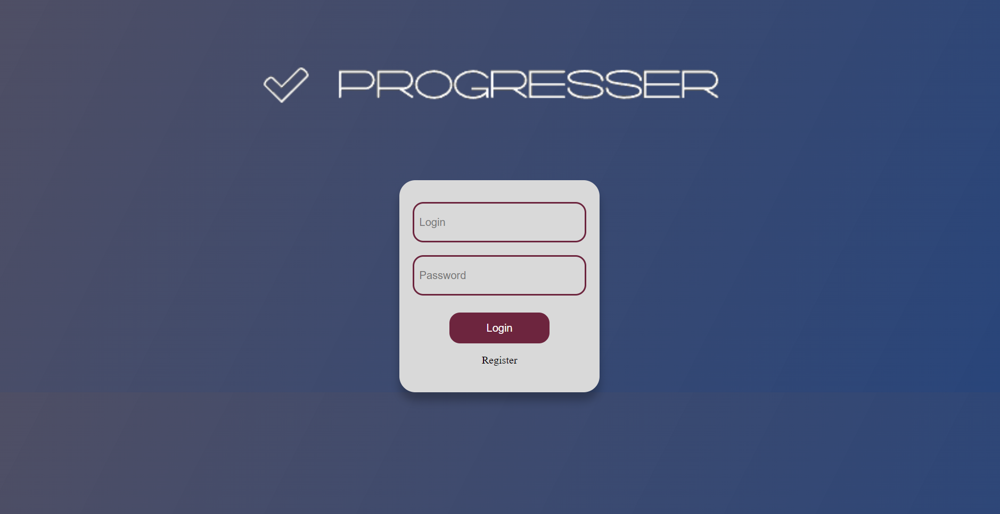
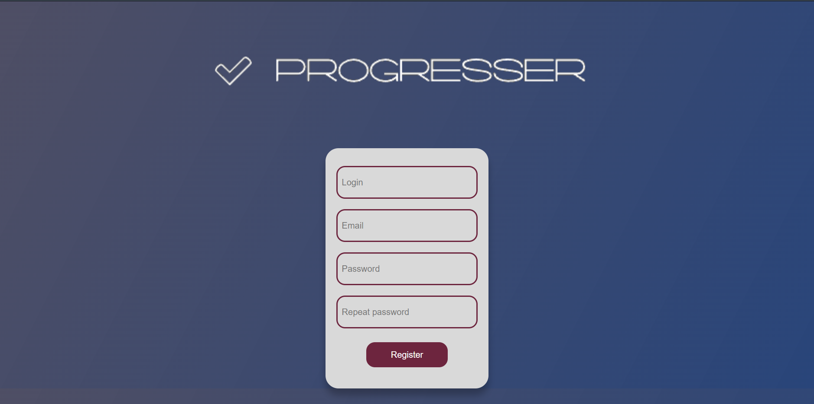
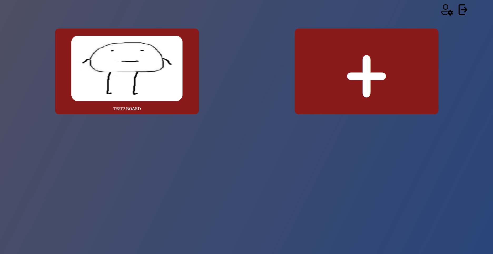
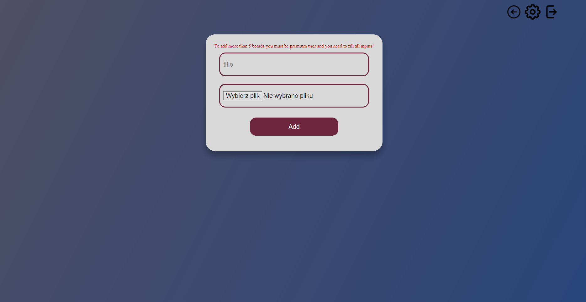
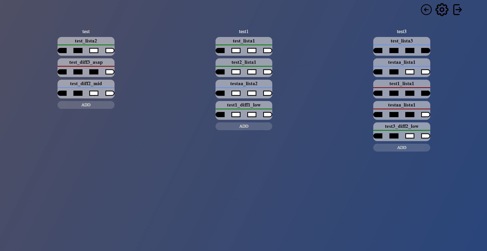
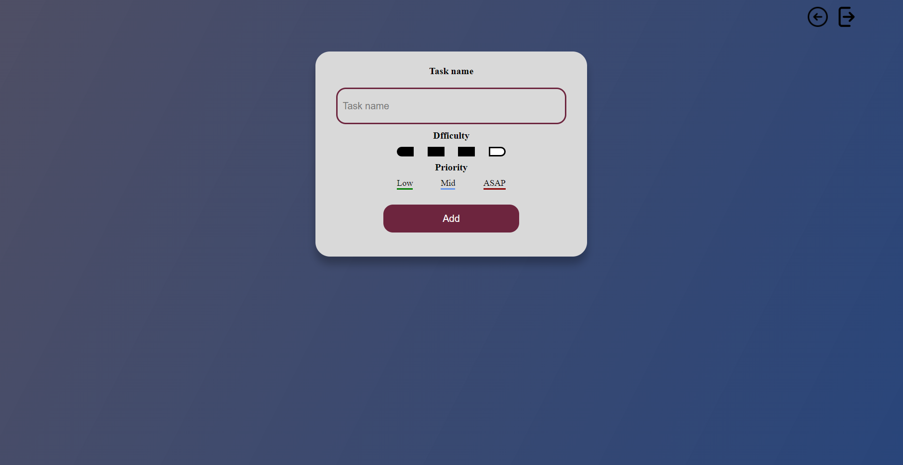

# Progresser
> Progress track website.

## Table of Contents
* [General Info](#general-information)
* [Technologies Used](#technologies-used)
* [Features](#features)
* [Screenshots](#screenshots)
* [Setup](#setup)
* [Room for Improvement](#room-for-improvement)
* [Acknowledgements](#acknowledgements)

## General Information
- Progresser is a todo website where you can track tasks and progress on your projects.

## Technologies Used
- PHP - 7.4.0
- HTML - 5
- CSS - 3
- JavaScript
- PostgreSQL
- Heroku
- Docker
- Git
- GitHub

## Features
List the ready features here:
- User can make multiple boards (Normal - 5 boards, Premium - unlimited) - each with individual image.
- Each board can have multiple lists.
- Each list can contain task - with difficulty and priority.

## Screenshots
<!--  -->

## Setup
To launch app you need IDE (ex. PHPStrom, VSCode) and Docker.
First run docker app, then in IDE terminal type "docker-compose up".
Now you can go to "localhost:8080" in your browser and enjoy application.

## Room for Improvement
Room for improvement:
- Add another user to your board.
- Add search bar for boards.
- Add board settings.
- Add lists

## Acknowledgements
Give credit here.
- Many thanks to Adrian Widłak for provided knowledge.
